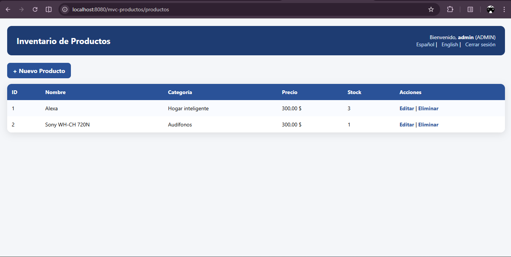
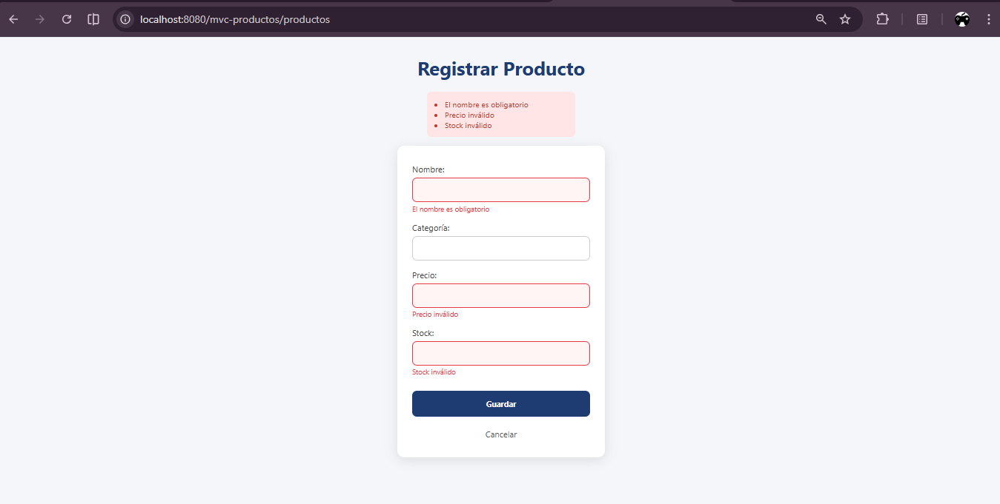
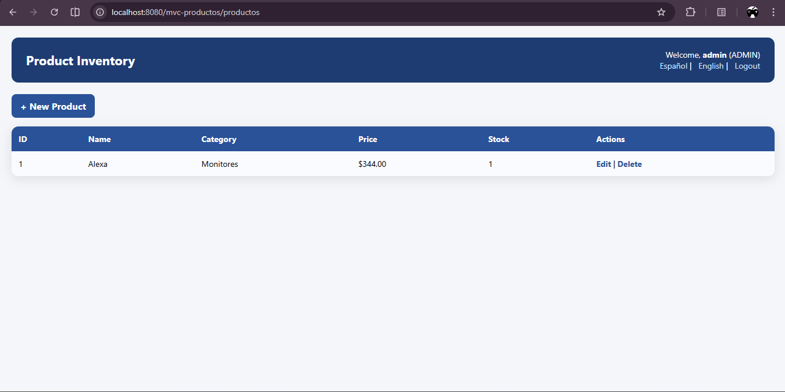
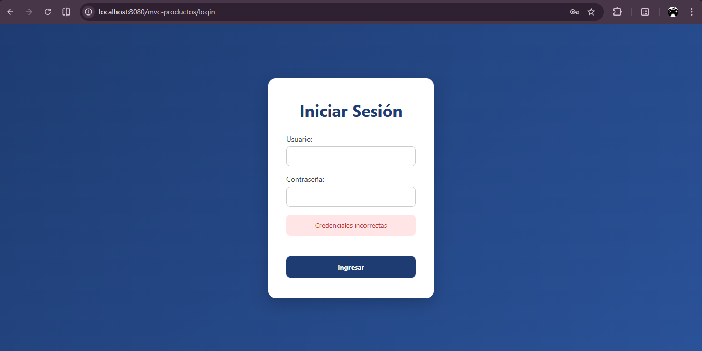

# 🧾 Sistema de Inventario de Productos (MVC con Java + JSP)

## 📌 Descripción del proyecto

Este proyecto consiste en una aplicación web desarrollada bajo el patrón **MVC (Modelo-Vista-Controlador)** utilizando **Java, Servlets, JSP y JSTL**.

Permite gestionar un inventario de productos con funcionalidades completas de **CRUD**, autenticación de usuario, manejo de sesión e internacionalización (**i18n**).

El sistema está diseñado como parte de un taller académico, aplicando buenas prácticas de desarrollo web en Java.

---

## ⚙️ Prerrequisitos

Antes de ejecutar el proyecto, asegúrate de tener instalado:

* ☕ JDK 11 o superior
* 📦 Apache Maven
* 🐱 Apache Tomcat (v9 o superior recomendado)
* 💻 Visual Studio Code (o cualquier IDE compatible con Java)
* 🌐 Navegador web (Chrome, Edge, Firefox)

---

## 🚀 Instrucciones de ejecución

1. **Clonar o descargar el proyecto**

```bash
git clone https://github.com/AndressToscanom30/toscano-post2-u6
```

---

2. **Compilar y empaquetar el proyecto**

```bash
mvn clean package
```

Esto generará un archivo `.war` dentro de la carpeta:

```bash
target/
```

---

3. **Desplegar en Tomcat**

Tienes dos opciones:

### 🔹 Opción 1: Manual

* Copia el archivo `.war` a:

```bash
apache-tomcat/webapps/
```

* Inicia el servidor Tomcat

---

### 🔹 Opción 2: Desde VS Code

* Usa la extensión de Tomcat
* Ejecuta **"Run on Server"**

---

4. **Acceder a la aplicación**

Abre en el navegador:

```text
http://localhost:8080/mvc-productos/login
```

---

## Credenciales de acceso

```
Usuario: admin
Contraseña: Admin123!
```

---

## Funcionalidades implementadas

✔ Autenticación de usuario (Login)
✔ Manejo de sesión
✔ Cierre de sesión (Logout)
✔ Listado de productos
✔ Registro de nuevos productos
✔ Edición de productos
✔ Eliminación de productos
✔ Validación de formularios
✔ Mensajes de error y éxito
✔ Internacionalización (Español / Inglés)
✔ Formateo de datos (precio con JSTL)
✔ Interfaz con estilos CSS personalizados

---

## Internacionalización (i18n)

El sistema permite cambiar dinámicamente el idioma entre:

* 🇪🇸 Español
* 🇺🇸 Inglés

Mediante el uso de archivos:

```
messages.properties
messages_es.properties
```

---

## 📸 Capturas de pantalla

### 🟢 Producto agregado

---

### 🔴 Error al enviar formulario vacío

---

### 🌍 Cambio de idioma a inglés

---

### 🔐 Error en login

---

## 🏗️ Estructura del proyecto (resumen)

```
src/
 ├── main/
 │   ├── java/
 │   │   └── com/universidad/mvc/
 │   │        ├── controller/
 │   │        ├── service/
 │   │        ├── model/
 │   │        └── dao/
 │   │
 │   ├── resources/
 │   │   ├── messages.properties
 │   │   └── messages_es.properties
 │   │
 │   └── webapp/
 │        ├── css/
 │        └── WEB-INF/views/
 │             ├── login.jsp
 │             ├── lista.jsp
 │             └── formulario.jsp
```

---

## 📚 Tecnologías utilizadas

* Java (Servlets)
* JSP
* JSTL
* Maven
* Apache Tomcat
* HTML5 + CSS3

---


## ✅ Estado del proyecto

✔ Funcional
✔ Cumple con los requisitos del taller
✔ Listo para mejoras futuras (roles, base de datos, frontend moderno)

---
